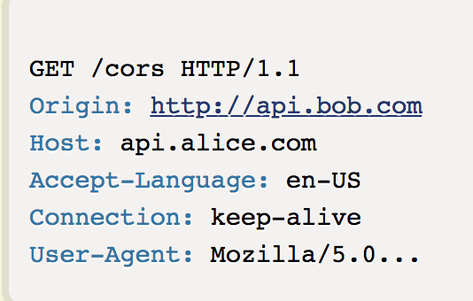
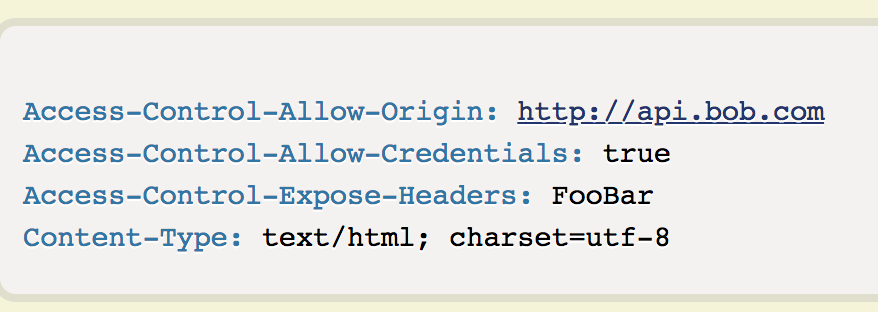
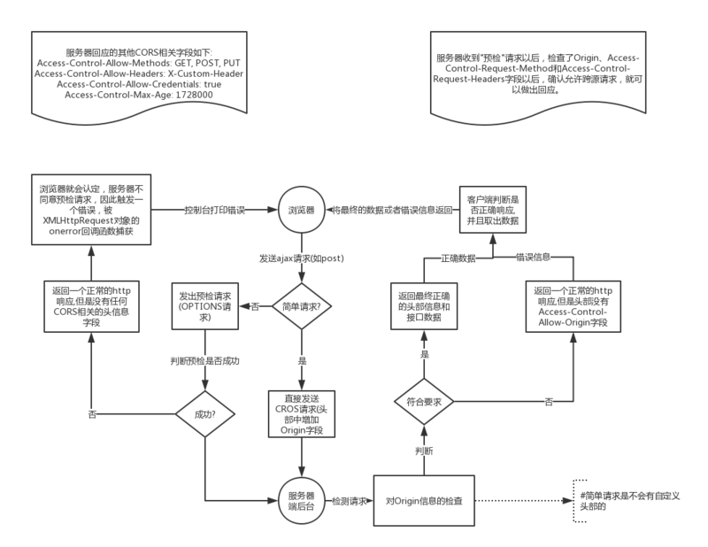
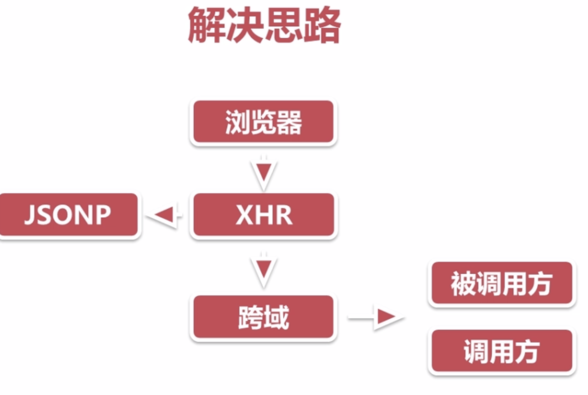
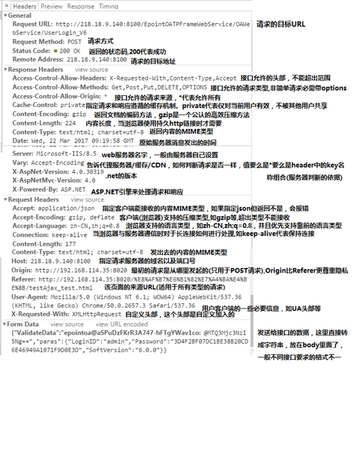

[ajax跨域，这应该是最全的解决方案了](https://segmentfault.com/a/1190000012469713#articleHeader12)

###  为什么会发生AJAX跨域？？？

#### 一：浏览器限制
当我们发送XMLHttpRequest请求的时候，如果（协议 域名 端口）不同，就会产生跨域问题（客户端无法获取服务端的数据）。
因此，我们注意到跨域问题是发生在XHR请求的时候，也就是説不是XHR的时候不会发生跨域=> 【JSONP】
【JSONP】 动态的创建script标签，使用标签的src属性访问JS文件的形式获取JS脚本，并且这个JS脚本中的内容是函数调用，该函数调用的参数是服务器返回的数据，为了获取这里的参数数据，需要事先在页面中定义回调函数，在回调函数中处理服务器返回的数据。

JSONP的弊端：
1.要对服务器的代码进行改动
2.只支持GET方法(原理是动态创建script来进行请求的)
3.发送的不是XMLHttpRequest请求(XMLHttpRequest请求有很多好用的特性)

#### 二：跨域
在后端配置客跨域的【CROS方式】全称是"跨域资源共享"（Cross-origin resource sharing）
CORS解决跨域问题(也就是我们服务端被调用方解决跨域的思路）

浏览器将CROS请求分为两类：simple request AND not-so-simple request
只要同事满足以下两种条件的 ，就属于简单请求：
1.请求方式 HEAD POST GET 之一
2.HTTP的头信息不超出以下几种字段：
Accept
Accept-Language
Content-Language
Last-Event-ID
Content-Type：只限于三个值application/x-www-form-urlencoded、multipart/form-data、text/plain
凡是不同时满足上面两个条件，就属于非简单请求。

Content-Type用于指定内容类型，一般是指网页中存在的Content-Type，Content-Type属性指定请求和响应的HTTP内容类型。如果未指定 ContentType，默认为text/html。
application/x-www-form-urlencoded是常用的表单发包方式，普通的表单提交，或者js发包，默认都是通过这种方式。
multipart/form-data用在发送文件的POST包。
text/xml微信用的是这种数据格式发送请求的。
application/json消息主体是序列化后的 JSON 字符串。
text/plain的意思是将文件设置为纯文本的形式，浏览器在获取到这种文件时并不会对其进行处理。
2.1 简单请求  对于简单请求，浏览器直接发出CORS请求。具体来说，就是在头信息之中，增加一个Origin字段。

Access-Control-Allow-Credentials表示是否允许发送Cookie ，开发者必须在AJAX请求中打开withCredentials属性。如果要发送Cookie，Access-Control-Allow-Origin就不能设为星号

2.2 非简单请求 是那种对服务器有特殊要求的请求，比如请求方法是PUT或DELETE，或者Content-Type字段的类型是application/json；
非简单请求的CORS请求，会在正式通信之前，增加一次HTTP查询请求，称为"预检"请求（preflight）。
Access-Control-Request-Method用来列出浏览器的CORS请求会用到哪些HTTP方法。
Access-Control-Request-Headers该字段是一个逗号分隔的字符串，指定浏览器CORS请求会额外发送的头信息字段，上例是X-Custom-Header。
服务器收到"预检"请求以后，检查了Origin、Access-Control-Request-Method和Access-Control-Request-Headers字段以后，确认允许跨源请求，就可以做出回应。
OPTIONS预检的优化 Access-Control-Max-Age: 返回结果可以用于缓存的最长时间，单位是秒。在Firefox中，上限是24小时 （即86400秒），而在Chromium 中则是10分钟（即600秒）。Chromium 同时规定了一个默认值 5 秒。如果值为 -1，则表示禁用缓存，每一次请求都需要提供预检请求，即用OPTIONS请求进行检测（即preflight请求-options）。

#### 三： XHR（XMLHttpRequest）请求
前端请求的ajax是本地接口，本地接口接受到请求后向实际的接口请求数据，然后再将信息返回给前端【代理方式】

2.解决思路？？？

