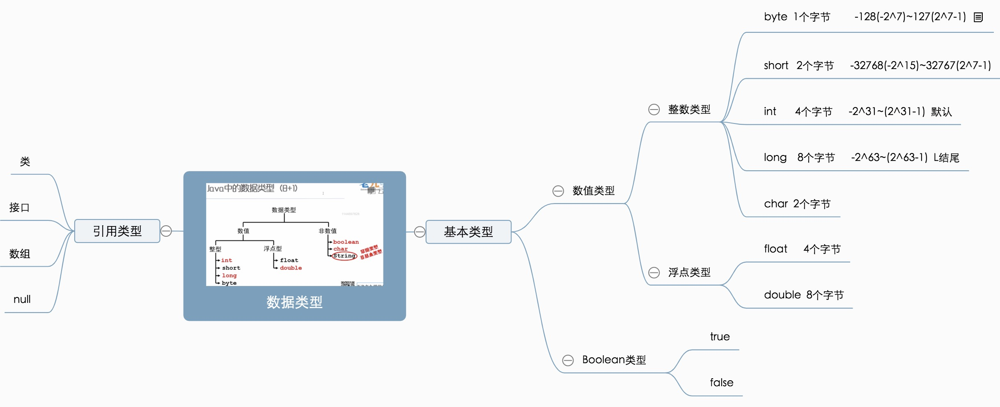

## 3.数据类型和运算符

### 3.1注释
单行注释 多行注释 文档注释  
Eclipse Java注释模板设置详解以及版权声明

### 3.2标识符和关键字
* 分号 Java采用（;）作为语句的分隔，因此每个Java语句 **必须** 使用分号作为结尾；
* 标识符（变量 类 方法命名的符号）命名规则。
* java 所有的关键字 都是**小写**

### 3.3数据类型分类

* Java强类型语言 1.所有的变量必须先声明，后使用。 2.指定类型的变量只能接受类型与之匹配的值。

> 编程的本质，就是对内存中数据的访问和修改 。程序所有的数据都会保存到内存中，程序员需要一定的访问机制来访问或修改内存中的数据。这种机制就是变量，每一个变量都代表了某一小块内存，而且变量是有名字的，程序对变量赋值，实际就是爸数据装入改变量所代表的内存区域的过程。程序读取变量的值，实际就是从改变量所代表的内存区域取值的过程。形象的理解： 变量相当于一个有名称的容器，改容器用于装各种不同类型的数据。

### 栈 堆 方法区 本地方法区 寄存器
栈 * 存储局部变量
堆 * new出来的数组或对象 
方法区 
本地方法区 * 和系统有关
寄存器 * 给CPU使用