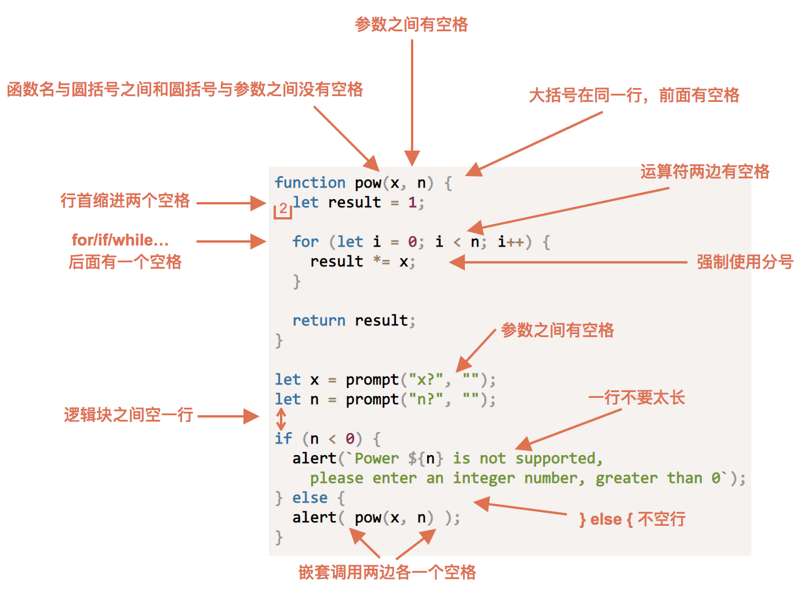

```
// 1. var let
for (var i = 0; i < 10; i++) {
    ((index)=>{
        setTimeout(()=>{
            console.log(index);
        },0)
    })(i)

    // setTimeout是异步执行，也即每一次for循环执行一次，settimeout都会执行一次，但是里面的settimeout并没有立即被执行，而是等到for循环结束，再执行；
    // for循环了10次，就放了10次，当主线程执行完成后，才进入任务队列里面执行。
    // setTimeout(()=>{
    //     console.log(i);
    // },0)
}

var lis = document.querySelector('.nav').querySelectorAll('li');
for (var i = 0; i < lis.length; i++) { //同步任务
    lis[i].index = i;
    lis[i].onclick = function() { //异步任务
        // console.log(i);
        console.log(this.index);

    }
}
```

```
2.函数参数默认值
function showMessage(a, b){
    if(b === undefiend){
        b = 0;
    }
    ...
}
function showMessage(a, b){
    b = b || 0;
    ...
}
function showMessage(a, b = 0){
    ...
}
```

```
3.创建函数
    - 函数声明
    - 函数表达式
    - 箭头函数
命名函数
"get…" —— 返回值，
"calc…" —— 计算
"create…" —— 创建，
"check…" —— 检查并返回 boolean 值，等。
```
```
4.现代模式，"use strict"
JavaScript 严格模式（strict mode）即在严格的条件下运行。
严格模式的限制
- 不允许使用未声明的变量
- 不允许删除变量或对象
- 不允许删除函数。
- 不允许变量重名
- 不允许使用八进制:
- 不允许使用转义字符
- 不允许对只读属性赋值
- 不允许对一个使用getter方法读取的属性进行赋值
- 不允许删除一个不允许删除的属性：
- 变量名不能使用 "eval" "arguments" 字符串:
- 禁止this关键字指向全局对象
```
5. 代码风格 自动检测器 ESlint


6. 中英文混合输入时候转大写 用 css
```
<input type="text" onkeyup="this.value=this.value.toUpperCase()">
input {
    text-transform: uppercase;
}
```

7. apply、call、bind区别、用法?
```
apply和call都是为了改变某个函数运行时的上下文而存在的（就是为了改变函数内部this的指向）

```

8.高阶函数 是对其他函数进行操作的函数，它接收函数作为参数或将函数作为返回值输出。

9. 闭包
```
1. 闭包是什么？    
    闭包是一个函数 （一个作用域可以访问另外一个函数的局部变量）
2. 闭包的作用是什么？ 
    延伸变量的作用范围

// 闭包应用-点击li输出当前li的索引号
// 1. 我们可以利用动态添加属性的方式
var lis = document.querySelector('.nav').querySelectorAll('li');
for (var i = 0; i < lis.length; i++) {
    lis[i].index = i;
    lis[i].onclick = function() {
        // console.log(i);
        console.log(this.index);

    }
}
// 2. 利用闭包的方式得到当前小li 的索引号
for (var i = 0; i < lis.length; i++) {
    // 利用for循环创建了4个立即执行函数
    // 立即执行函数也成为小闭包因为立即执行函数里面的任何一个函数都可以使用它的i这变量
    (function(i) {
        // console.log(i);
        lis[i].onclick = function() {
            console.log(i);

        }
    })(i);
}
```

10. 递归
```
js中"Maximum call stack size exceeded"解决方法
错误直译过来就是“栈溢出”，出现这个错误的原因是因为我进行了递归运算，但是忘记添加判断条件，导致递归无线循环下去。。
由于递归很容易发生“栈溢出”错误（stack overflow），所以必须要加退出条件 return。
```
11. 浅拷贝 深拷贝
```
浅拷贝只是拷贝一层, 更深层次对象级别的只拷贝引用.
深拷贝拷贝多层, 每一级别的数据都会拷贝.
Object.assign(target, ...sources)    es6 新增方法可以浅拷贝
分配assign
for...in语句以任意顺序遍历一个对象的除Symbol以外的可枚举属性。继承的属性不显示
   // 深拷贝拷贝多层, 每一级别的数据都会拷贝.
        var obj = {
            id: 1,
            name: 'andy',
            msg: {
                age: 18
            },
            color: ['pink', 'red']
        };
        var o = {};
        // 封装函数 
        function deepCopy(newobj, oldobj) {
            for (var k in oldobj) {
                // 判断我们的属性值属于那种数据类型
                // 1. 获取属性值  oldobj[k]
                var item = oldobj[k];
                // 2. 判断这个值是否是数组
                if (item instanceof Array) {
                    newobj[k] = [];
                    deepCopy(newobj[k], item)
                } else if (item instanceof Object) {
                    // 3. 判断这个值是否是对象
                    newobj[k] = {};
                    deepCopy(newobj[k], item)
                } else {
                    // 4. 属于简单数据类型
                    newobj[k] = item;
                }

            }
        }
        deepCopy(o, obj);
        console.log(o);

        var arr = [];
        console.log(arr instanceof Object);
        o.msg.age = 20;
        console.log(obj);
```
12 [函数防抖debounce和节流throttle](https://github.com/mqyqingfeng/Blog/issues/26)
防抖的原理就是：你尽管触发事件，但是我一定在事件触发 n 秒后才执行，如果你在一个事件触发的 n 秒内又触发了这个事件，那我就以新的事件的时间为准，n 秒后才执行，总之，就是要等你触发完事件 n 秒内不再触发事件，我才执行，真是任性呐!