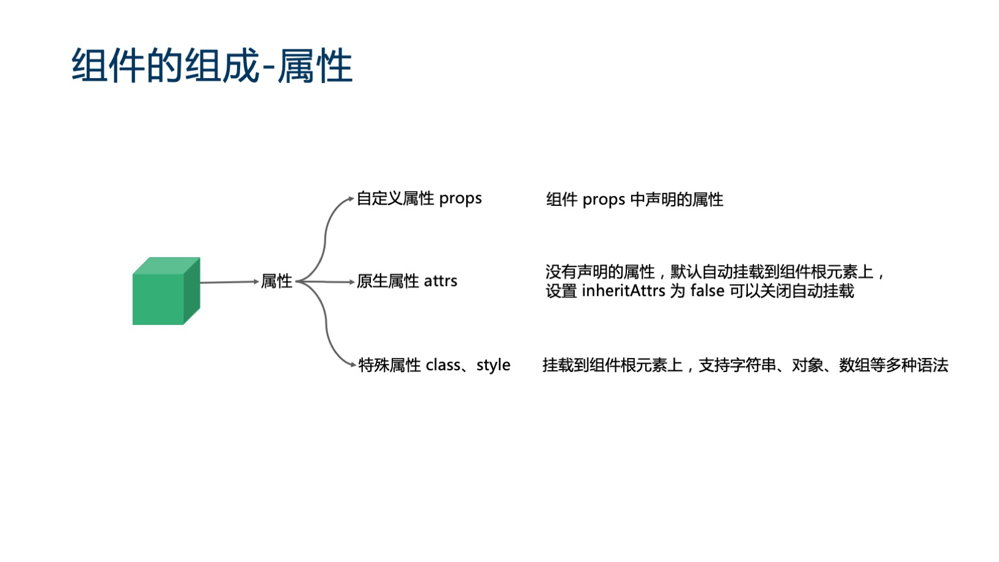

### 一些概念
- 声明式渲染 响应式
- 指令 eg: v-model
- v-on 指令添加一个事件监听器.所有的 DOM 操作都由 Vue 来处理，你编写的代码只需要关注逻辑层面即可。
- 组件系统是 Vue 的另一个重要概念，因为它是一种抽象，允许我们使用小型、独立和通常可复用的组件构建大型应用。
- 声明周期函数
**beforeCreate创建前状态 created创建完毕状态 beforeMount挂载前状态 mounted挂载结束状态 beforeUpdate更新前状态 updated更新完成状态 beforeDestroy销毁前状态 destroyed销毁完成状态**

[声明周期函数link](https://segmentfault.com/a/1190000011381906)
```
           beforeCreate: function () {
                console.group('------beforeCreate创建前状态------');
                console.log("%c%s", "color:red", "el     : " + this.$el); //undefined
                console.log("%c%s", "color:red", "data   : " + this.$data); //undefined 
                console.log("%c%s", "color:red", "message: " + this.message)
            },
            created: function () {
                console.group('------created创建完毕状态------');
                console.log("%c%s", "color:red", "el     : " + this.$el); //undefined
                console.log("%c%s", "color:red", "data   : " + this.$data); //已被初始化 
                console.log("%c%s", "color:red", "message: " + this.message); //已被初始化
            },
            beforeMount: function () {
                console.group('------beforeMount挂载前状态------');
                console.log("%c%s", "color:red", "el     : " + (this.$el)); //已被初始化
                console.log(this.$el);
                console.log("%c%s", "color:red", "data   : " + this.$data); //已被初始化  
                console.log("%c%s", "color:red", "message: " + this.message); //已被初始化  
            },
            mounted: function () {
                console.group('------mounted 挂载结束状态------');
                console.log("%c%s", "color:red", "el     : " + this.$el); //已被初始化
                console.log(this.$el);
                console.log("%c%s", "color:red", "data   : " + this.$data); //已被初始化
                console.log("%c%s", "color:red", "message: " + this.message); //已被初始化 
            },
            beforeUpdate: function () {
                console.group('beforeUpdate 更新前状态===============》');
                console.log("%c%s", "color:red", "el     : " + this.$el);
                console.log(this.$el);
                console.log("%c%s", "color:red", "data   : " + this.$data);
                console.log("%c%s", "color:red", "message: " + this.message);
            },
            updated: function () {
                console.group('updated 更新完成状态===============》');
                console.log("%c%s", "color:red", "el     : " + this.$el);
                console.log(this.$el);
                console.log("%c%s", "color:red", "data   : " + this.$data);
                console.log("%c%s", "color:red", "message: " + this.message);
            },
            beforeDestroy: function () {
                console.group('beforeDestroy 销毁前状态===============》');
                console.log("%c%s", "color:red", "el     : " + this.$el);
                console.log(this.$el);
                console.log("%c%s", "color:red", "data   : " + this.$data);
                console.log("%c%s", "color:red", "message: " + this.message);
            },
            destroyed: function () {
                console.group('destroyed 销毁完成状态===============》');
                console.log("%c%s", "color:red", "el     : " + this.$el);
                console.log(this.$el);
                console.log("%c%s", "color:red", "data   : " + this.$data);
                console.log("%c%s", "color:red", "message: " + this.message)
            }
  ```
- 计算属性 computed 
1.计算属性的getter函数
2.计算属性的setter函数
3.计算属性的cache缓存属性
- 虽然计算属性在大多数情况下更合适，但有时也需要一个**自定义的侦听器**。这就是为什么 Vue 通过 watch 选项提供了一个更通用的方法，来响应数据的变化。当需要在数据变化时执行异步或开销较大的操作时，这个方式是最有用的
- 操作元素的 **class 列表和内联样式**是数据绑定的一个常见需求。因为它们都是属性，所以我们可以用 v-bind 处理它们：只需要通过表达式计算出字符串结果即可。不过，字符串拼接麻烦且易错。因此，在将 v-bind 用于 class 和 style 时，Vue.js 做了专门的增强。表达式结果的类型除了字符串之外，还可以是对象或数组。
- 条件渲染
- 列表渲染
- 事件处理 事件修饰符 系统修饰键
- 表单输入绑定 
v-model 指令在表单 <input>、<textarea> 及 <select> 元素上创建双向数据绑定

### 1.组件的三大核心概念：属性、事件和插槽。

