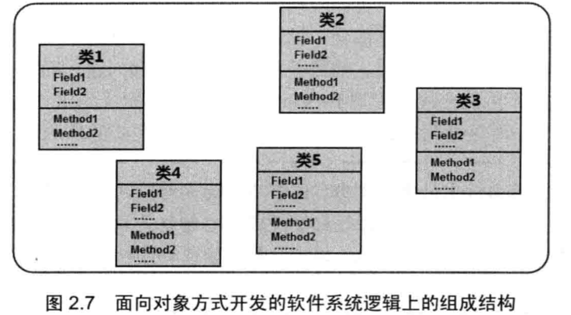
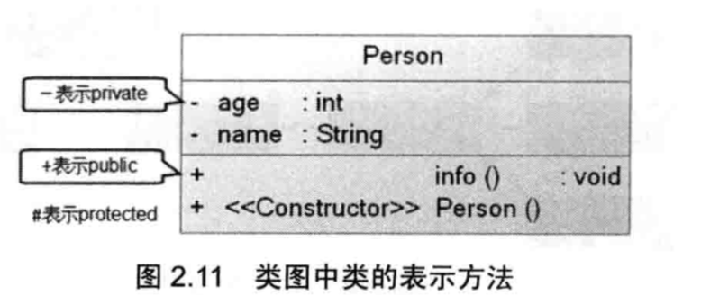
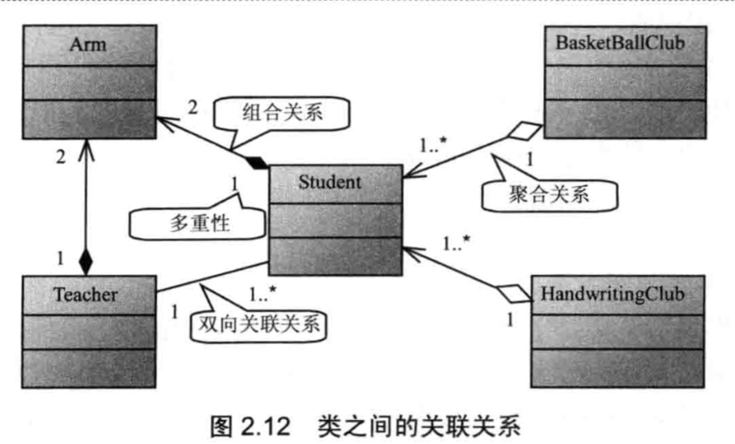

### 面向对象
#### 1.程序的三种基本结构
顺序结构 选择结构 循环结构
#### 2.面向对象程序设计
> 面向对象是一种优秀的程序设计方法，它的基本思想是使用类，对象，继承，封装，消息等基本概念进行程序设计。它从现实世界中客观存在的事物（即对象）出发来构造软件系统，并在系统构造中尽可能使用人类自然的思维方式。强调直接以现实世界中的事物（即对象）为中心思考，认识问题，并根据这些事物的本质特点，把它们抽象地表示为系统中的类，作为系统的基本构成单元，这使得软件系统的组件可以直接映像到客观世界，并保持客观世界中事物及其相互关系的本来面貌。

* 猪八戒吃西瓜
1. 面向过程--吃（猪八戒， 西瓜）
2. 面向对象--猪八戒。吃（习惯）

#### 3.面向对象的基本特征
* 封装----将对象的实现细节隐藏起来，然后通过一些公用的方法来暴露该对象的功能。
* 继承----实现软件复用的重要手段 子类继承父类 子类作为一种特殊的父类
* 多态----子类对象可以直接赋给父类变量，但运行时候依然表现出子类的行为特征。这个意味着同一个类型的对象在执行同一个方法的时候 可能表现出多种行为特征。

面向对象还支持如下功能。
* 对象是面向对象方法中最基本的概念 特点： 标识的唯一性 分类性 多态性 封装性 模块独立性
* 类是具有共同属性 共同方法的一类事物。类是对象的抽象。  对象是类的实例。

#### 4. 面向对象 和 基于对象的区别
基于对象--也是使用了对象 但是无法利用现有的对象模板产生新的对象类型 继而产生新的对象 也就是説没有继承的特点。没有继承的概念也就无从谈论多态。面向对象三大基本特征缺一不可。eg:Javascript语言就是基于对象的。

#### 5. UML统一建模语言2.0 (描述 记录软件分析设计的工具)
13种正式 活动图 + 类图 + 通信图 + 组件图 + 复合结构图 + 部署图 + 交互概观图 + 对象图 + 包图 + 顺序图 + 状态机图 + 定时图 + 用例图

> 类和类之间的关系
* 关联 （包括聚合 组合）
* 泛化 （与继承同一个概念）
* 依赖 